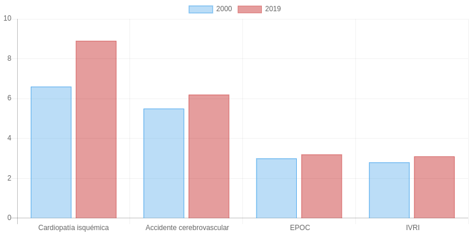

Title:   Qué sienten las mujeres cuando sufren un infarto de miocardio
Summary: Síntomas no tan comunes como náuseas, dolor abdominal o tos son algunos de los que sufren las mujeres al sufrir un infarto de miocardio.
Authors: Nabil Subhi-Issa
Date:    22 febrero 2021
Tags:    ataque cardiaco, infarto, mujeres, noticia, síntomas

**Síntomas no tan comunes como náuseas, dolor abdominal o tos son algunos de los que sufren las mujeres al sufrir un infarto de miocardio. Esto ocasiona que no se identifique a tiempo y puede provocar un aumento de la mortalidad.**

Seguramente más de una vez habrás oído hablar de los infartos, las anginas de pecho o las arritmias. Todas ellas son enfermedades del corazón (cardiopatías) y afectan a un número cada vez más alto de personas. Es posible que también hayas oído que los síntomas más comunes del infarto pueden ser dolor en el pecho o dolor en uno o ambos brazos. Lo que igual no sabías era que existen otros muchos síntomas y además pueden existir ciertas diferencias en los síntomas de infarto entre mujeres y hombres.[^1]

## ¿Qué es un infarto?

Pero empecemos con lo básico. El infarto (también llamado ataque al corazón o infarto de miocardio) se engloba dentro de las llamadas cardiopatías isquémicas. Sucede cuando el flujo de sangre que llega para oxigenar el tejido miocárdico (músculo del corazón) se detiene. Esto puede ser debido a las placas de ateroma (depósitos de grasa, colesterol y células en las paredes de las arterias), de ahí el peligro de un elevado colesterol sanguíneo. Merece la pena destacar que un ataque al corazón no es lo mismo que un paro cardiaco ya que en este último se detiene el bombeo de sangre. El ataque al corazón puede causar un paro cardiaco, pero este último puede suceder sin que exista el primero.

## Síntomas en mujeres vs hombres

Desde hace unos años, existe evidencia sólida de que los síntomas de infarto en mujeres pueden ser diferentes. Ciertos investigadores que analizaron 69 estudios diferentes encontraron que del 30 al 37% de las mujeres no experimentaban dolor en el pecho. En contraste, esto ocurría solo del 17 al 27% en hombres. No obstante, encontraron que la gente mayor es más probable que tenga un infarto sin siquiera dolor en el pecho. Adicionalmente, los autores informaron de que las mujeres exhiben un mayor repertorio de síntomas asociados al ataque cardiaco, por ejemplo, nauseas, dolor abdominal, pérdida de apetito, debilidad, tos, mareos y palpitaciones. Por ello, es posible que se diagnostique erróneamente con un aumento en las probabilidades de morir. Es importante saber que las mujeres son de media una década mayor que los hombres en el momento de su primer infarto, por lo que es necesaria mayor investigación para determinar el grado de influencia del sexo y la edad en el aumento de la mortalidad. Si bien es cierto que el síntoma principal es dolor en el pecho, puede existir diversos síntomas asociados a la edad, sexo y otros factores. Por ello, es necesaria una mayor investigación en este campo con estudios bien diseñados para determinar diferencias en sintomatología de las enfermedades coronarias.

## Datos de muertes por cardiopatías isquémicas en el mundo

Como curiosidad aquí os dejo una gráfica con las principales causas de muertes en el mundo en los años 2000 y 2019. Las enfermedades cardiovasculares constituyen la principal causa de muerte en el mundo. En particular, la cardiopatía isquémica constituye la primera, siendo el 16% del total de muertes en el mundo. Desde el año 2000, se ha registrado un aumento de muertes en 2 millones, hasta 8,9 millones en 2019  (fuente consultada: https://www.who.int/es/news-room/fact-sheets/detail/the-top-10-causes-of-death). Es curioso como, a pesar de saber cada vez más acerca de las causas de estas enfermedades, aún estamos lejos de reducir la mortalidad y la morbilidad en este aspecto; especialmente en países más ricos.

## Referencias

[^1]: This is the first footnote.

